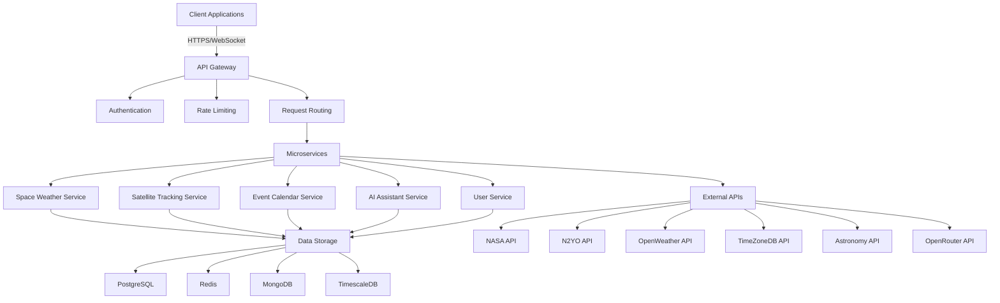
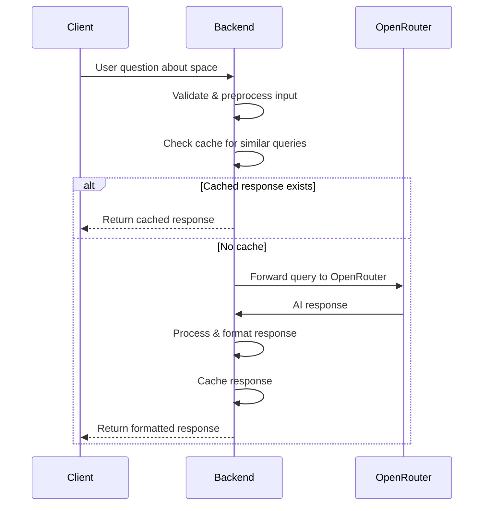

# Cosmofy - Comprehensive Documentation

*Last Updated: June 3, 2025*  
*Version: 1.0.0*  

## Table of Contents
1. [Project Overview](#project-overview)
2. [Features](#features)
3. [Technical Architecture](#technical-architecture)
4. [API Integrations](#api-integrations)
5. [AI Implementation](#ai-implementation)
6. [Setup Guide](#setup-guide)
7. [Project Structure](#project-structure)
8. [Development Workflow](#development-workflow)
9. [Deployment](#deployment)
10. [Testing](#testing)
11. [Performance](#performance)
12. [Security](#security)
13. [Analytics](#analytics)
14. [Troubleshooting](#troubleshooting)
15. [FAQ](#frequently-asked-questions)
16. [Contributing](#contributing)
17. [License](#license)
18. [Acknowledgments](#acknowledgments)
19. [Changelog](#changelog)
20. [Roadmap](#roadmap)

## Table of Contents
1. [Project Overview](#project-overview)
2. [Features](#features)
3. [Technical Architecture](#technical-architecture)
4. [API Integrations](#api-integrations)
5. [AI Implementation](#ai-implementation)
6. [Setup Guide](#setup-guide)
7. [Project Structure](#project-structure)
8. [Development Workflow](#development-workflow)
9. [Troubleshooting](#troubleshooting)
10. [FAQ](#frequently-asked-questions)

## Project Overview

Cosmofy is a comprehensive space exploration platform that provides real-time space data visualization and interactive experiences. Built with modern web technologies, it serves as a centralized hub for space enthusiasts, researchers, and curious minds to explore various aspects of space, including weather, satellite tracking, astronomical events, and more.

### Core Purpose
- **Real-time Space Monitoring**: Track space weather, satellite positions, and celestial events in real-time
- **Educational Resource**: Provide accurate, accessible space information for learning and research
- **Interactive Exploration**: Enable users to explore the solar system and space phenomena through interactive visualizations
- **Data Aggregation**: Centralize space-related data from multiple reliable sources
- **Community Engagement**: Foster a community of space enthusiasts through shared experiences and knowledge

### Target Audience
1. **Space Enthusiasts**
   - Amateur astronomers
   - Space hobbyists
   - Night sky observers

2. **Education Sector**
   - Students (middle school to university)
   - Educators and teachers
   - Science communicators

3. **Research Community**
   - Astronomy researchers
   - Data scientists
   - Space industry professionals

4. **General Public**
   - Curious individuals
   - Families interested in space
   - Casual learners

### Key Differentiators
- **Comprehensive Integration**: Combines multiple space data sources into a single platform
- **AI-Powered Insights**: Advanced AI assistant for personalized space information
- **Educational Focus**: Designed with learning and discovery in mind
- **Responsive Design**: Works seamlessly across desktop and mobile devices
- **Open Source**: Community-driven development and transparency

## Features

### 1. Dashboard
- **Personalized Overview**: Customizable dashboard with key space information
- **Quick Access**: Shortcuts to frequently used features
- **Recent Activity**: Track your recent interactions and saved items
- **Custom Widgets**: Add, remove, and arrange information cards

### 2. Space Weather Center
- **Solar Activity Monitoring**
  - Real-time solar flare tracking with X-ray flux measurements
  - Sunspot visualization with detailed classification (Modified Zurich classification)
  - Solar wind speed and particle density measurements
  - Coronal mass ejection (CME) tracking and impact prediction
  - Historical data comparison with 30-day trend analysis

- **Geomagnetic Conditions**
  - Real-time KP index visualization (0-9 scale)
  - Auroral oval visualization and visibility predictions
  - Geomagnetic storm alerts with intensity classification
  - Magnetosphere status and solar wind interaction visualization
  - 3D magnetic field line visualization

### 3. Spacecraft Tracking System
- **Real-time Satellite Tracking**
  - Live positions of 20,000+ satellites with orbital elements
  - International Space Station (ISS) tracking with crew information
  - Starlink satellite train visualization
  - Historical trajectory data and orbital decay analysis

- **Visualization Tools**
  - 3D Earth view with satellite orbits
  - Ground track visualization with visibility predictions
  - Satellite pass predictions for any location
  - Field of view simulation for observation planning

- **Advanced Features**
  - TLE (Two-Line Element) data management
  - Custom satellite catalog management
  - Observation planning tools
  - Pass prediction notifications via email/webhook

### 4. Event Calendar System
- **Launch Schedule**
  - Upcoming rocket launches with mission details
  - Launch vehicle and payload information
  - Live launch webcast integration
  - Historical launch database

- **Celestial Events**
  - Meteor shower activity calendar
  - Solar and lunar eclipse predictions
  - Planetary conjunctions and oppositions
  - Comet and asteroid close approaches

- **Custom Events**
  - Personal observation planning
  - Community events and star parties
  - Astronomical phenomena alerts
  - Observation log integration

### 5. Interactive Solar System
- **3D Visualization**
  - Scale-accurate planetary models
  - Real-time planetary positions (JPL DE430 ephemerides)
  - Moon phases and libration visualization
  - Dwarf planets and major asteroids

- **Educational Content**
  - Detailed planetary information cards
  - Comparative planetology tools
  - Historical mission landing sites
  - Surface feature exploration with high-resolution imagery

- **Simulation Controls**
  - Time manipulation (speed up/slow down)
  - View customization (ecliptic, equatorial, galactic)
  - Reference frames (heliocentric, geocentric)
  - Observation tools (field of view, angular measurements)

### 6. AI Assistant (Cosmo)
- **Natural Language Interface**
  - Context-aware space Q&A
  - Complex astronomical calculations
  - Data visualization generation
  - Personalized recommendations

- **Educational Features**
  - Interactive tutorials and walkthroughs
  - Quizzes and knowledge challenges
  - Learning pathways for different levels
  - Progress tracking and achievements

### 7. User Account Features
- **Personalization**
  - Custom dashboard layouts
  - Saved locations and observation sites
  - Notification preferences
  - Theme customization (light/dark/high contrast)

- **Data Management**
  - Observation logs with image uploads
  - Custom notes and annotations
  - Data export options (CSV, JSON, KML)
  - API key management

### 8. Mobile Experience
- **Responsive Design**
  - Full functionality on mobile devices
  - Touch-optimized controls
  - Offline access to key data
  - Push notifications for events and alerts

- **Augmented Reality**
  - Night sky identification
  - Satellite tracking overlay
  - Celestial object finder
  - Constellation visualization

## Technical Architecture

### System Architecture Overview


### Frontend Architecture

#### Core Technologies
- **Framework**: Next.js 15 with App Router
- **UI Library**: React 18 with Concurrent Features
- **Type System**: TypeScript 5.0+
- **Styling**: 
  - Tailwind CSS 3.3+ with JIT compiler
  - CSS Modules for component-scoped styles
  - Framer Motion for animations
- **State Management**:
  - TanStack Query v5 (Server State)
  - Zustand (Client State)
  - React Context (Theme, Auth)
- **Form Handling**: React Hook Form with Zod validation
- **Data Visualization**:
  - React Three Fiber (3D)
  - D3.js (2D Charts)
  - Mapbox GL JS (Geospatial)
- **Internationalization**: next-intl
- **Accessibility**: WAI-ARIA compliant components

#### Component Architecture
```
src/
├── app/                      # App Router pages
│   ├── (auth)/               # Authentication routes
│   ├── (main)/               # Main application routes
│   │   ├── dashboard/        # Dashboard page
│   │   ├── space-weather/    # Space weather section
│   │   └── ...
│   └── api/                 # API routes
│
├── components/              # Reusable components
│   ├── ui/                   # ShadCN/UI components
│   ├── space/                # Space-specific components
│   ├── maps/                 # Map components
│   ├── visualizations/       # Data visualization components
│   └── layout/               # Layout components
│
├── lib/                     # Utility functions and hooks
│   ├── api/                  # API clients and services
│   ├── hooks/                # Custom React hooks
│   ├── utils/                # Utility functions
│   └── types/                # TypeScript type definitions
│
├── styles/                  # Global styles and themes
│   ├── globals.css           # Global CSS
│   └── theme/                # Theme configurations
│
└── public/                  # Static assets
    ├── images/               # Image assets
    └── models/               # 3D models
```

### Backend Architecture

#### Server Components
- **Runtime**: Node.js 18+ with TypeScript
- **API Layer**:
  - Next.js API Routes
  - tRPC for type-safe APIs
  - RESTful endpoints for external services
- **Authentication**:
  - NextAuth.js with JWT
  - OAuth 2.0 providers (Google, GitHub)
  - Session management with Redis
- **Database**:
  - PostgreSQL (Primary relational database)
  - Redis (Caching and pub/sub)
  - MongoDB (User preferences, logs)
  - TimescaleDB (Time-series data)
- **Search**:
  - MeiliSearch (Full-text search)
  - PostgreSQL full-text search
- **Real-time Updates**:
  - Server-Sent Events (SSE)
  - WebSockets for real-time features

#### Data Flow
1. **Client Request**
   - User interacts with the UI
   - API request is sent to Next.js API route
   - Authentication middleware validates the request

2. **API Processing**
   - Rate limiting is applied (1000 requests/hour per IP)
   - Request is validated against Zod schemas
   - Business logic is executed in the appropriate service
   - Database queries are performed with connection pooling
   - External API calls are made with retry logic

3. **Response**
   - Data is transformed to match frontend requirements
   - Response is cached if appropriate (Redis)
   - Standardized response format is returned

4. **Client Update**
   - UI is updated with React Query
   - Loading/error states are handled gracefully
   - Optimistic updates for better UX

### AI Integration

#### Architecture


#### Implementation Details
- **AI Model**: DeepSeek Chat (via OpenRouter)
- **Context Management**:
  - 8K token context window
  - Dynamic context injection based on query type
  - Conversation history management
- **Prompt Engineering**:
  - System prompts for different query types
  - Few-shot learning examples
  - Output formatting instructions
- **Caching**:
  - Redis cache for common queries (1-hour TTL)
  - Response deduplication
  - Rate limiting per user
- **Error Handling**:
  - Fallback responses
  - Error classification
  - User-friendly error messages

### Performance Optimization

#### Client-Side
- **Code Splitting**: Dynamic imports for large components
- **Image Optimization**: Next.js Image component with WebP
- **Bundle Analysis**: webpack-bundle-analyzer
- **Performance Monitoring**: Sentry for error tracking
- **Service Worker**: Offline support for key features

#### Server-Side
- **Edge Caching**: Vercel Edge Network
- **Database Optimization**:
  - Query optimization with EXPLAIN ANALYZE
  - Indexing strategy
  - Connection pooling
- **CDN**: Static assets served via CDN
- **Compression**: Brotli and GZIP compression

### Security Measures
- **Authentication**: JWT with short expiration
- **Authorization**: Role-based access control
- **Input Validation**: Zod schema validation
- **Rate Limiting**: Redis-based rate limiting
- **CORS**: Strict CORS policy
- **CSP**: Content Security Policy
- **Security Headers**: HSTS, XSS Protection
- **Data Protection**: Encryption at rest and in transit

## API Integrations

### 1. NASA API
- **Purpose**: Space weather, asteroid data, and space imagery
- **Key Endpoints**:
  - DONKI: Space weather database
  - NEO: Near Earth Objects
  - APOD: Astronomy Picture of the Day
- **Rate Limit**: 1,000 requests/hour

### 2. N2YO API
- **Purpose**: Satellite tracking and orbital data
- **Key Features**:
  - Real-time satellite positions
  - Visual pass predictions
  - TLE (Two-Line Element) data
- **Rate Limit**: 1,000 requests/day

### 3. OpenWeather API
- **Purpose**: Ground weather conditions
- **Data Points**:
  - Current weather
  - Weather alerts
  - Forecast data
- **Rate Limit**: 60 calls/minute

### 4. TimeZoneDB API
- **Purpose**: Timezone information
- **Usage**: Accurate event timing across timezones
- **Rate Limit**: 1 request/second

### 5. Astronomy API
- **Purpose**: Astronomical calculations
- **Features**:
  - Celestial body positions
  - Rise/set times
  - Moon phases

## AI Implementation

### Architecture
- **AI Model**: DeepSeek Chat via OpenRouter
- **Integration Layer**: Genkit (minimal)
- **Flow**: Space Explainer (handles Q&A about space topics)

### Key Components
1. **AI Context**: Predefined context about Cosmofy's features
2. **Prompt Engineering**: Structured prompts for accurate responses
3. **Error Handling**: Graceful degradation when AI is unavailable

### Implementation Details
- Direct API calls to OpenRouter
- Response caching for common queries
- Input validation and sanitization

## Setup Guide

### Prerequisites
- Node.js 18+ and npm/yarn
- API keys for all required services
- Modern web browser (Chrome, Firefox, Safari, Edge)

### Installation Steps

1. **Clone the repository**
   ```bash
   git clone https://github.com/your-username/cosmofy-fire.git
   cd cosmofy-fire
   ```

2. **Install dependencies**
   ```bash
   npm install
   # or
   yarn install
   ```

3. **Configure environment variables**
   Create a `.env` file with all required API keys (refer to README for details)

4. **Run the development server**
   ```bash
   npm run dev
   # or
   yarn dev
   ```
   The application will be available at `http://localhost:3000`

### Environment Variables
```env
# Base URL
NEXT_PUBLIC_SITE_URL=http://localhost:3000

# NASA API
NASA_API_KEY=your_nasa_api_key
NEXT_PUBLIC_NASA_API_KEY=your_nasa_api_key

# OpenRouter API (for AI features)
OPENROUTER_API_KEY=your_openrouter_api_key

# N2YO API (for satellite tracking)
N2YO_API_KEY=your_n2yo_api_key

# Astronomy API
ASTRONOMY_API_APP_ID=your_astronomy_app_id
ASTRONOMY_API_SECRET=your_astronomy_secret

# OpenWeather API
OPENWEATHER_API_KEY=your_openweather_api_key
NEXT_PUBLIC_OPENWEATHER_API_KEY=your_openweather_api_key

# TimeZoneDB API
TIMEZONEDB_API_KEY=your_timezonedb_api_key
NEXT_PUBLIC_TIMEZONEDB_API_KEY=your_timezonedb_api_key
```

## Project Structure

```
cosmofy/
├── public/                 # Static files
│   └── img/                # Images and assets
│       ├── dashboard/      # Dashboard background images
│       └── logo/           # Application logos and icons
│
├── src/
│   ├── app/                # App Router pages and layouts
│   │   ├── api/            # API routes
│   │   ├── dashboard/      # Dashboard page
│   │   ├── events/         # Events calendar
│   │   └── ...             # Other pages
│   │
│   ├── components/        # Reusable UI components
│   │   ├── ui/             # ShadCN components
│   │   ├── space/          # Space-related components
│   │   └── ...             # Other components
│   │
│   ├── lib/              # Utility functions and helpers
│   ├── styles/             # Global styles
│   └── types/              # TypeScript type definitions
│
├── .env.local            # Environment variables (not versioned)
├── next.config.js         # Next.js configuration
├── package.json           # Project dependencies
└── tsconfig.json          # TypeScript configuration
```

## Development Workflow

### Getting Started
1. Create a new branch for your feature/fix
2. Make your changes
3. Write tests if applicable
4. Run the development server to test locally
5. Create a pull request when ready

### Available Scripts
- `npm run dev` - Start development server
- `npm run build` - Create production build
- `npm start` - Start production server
- `npm run lint` - Run ESLint
- `npm run type-check` - Check TypeScript types

### Testing
(Add testing instructions if applicable)

## Troubleshooting

### Common Issues

#### API Rate Limiting
- Symptom: API requests failing with 429 status
- Solution: Respect rate limits, implement caching, or upgrade API plan

#### Missing Environment Variables
- Symptom: Application fails to start with missing env vars
- Solution: Ensure all required environment variables are set in `.env`

#### 3D Performance Issues
- Symptom: Slow rendering in the solar system view
- Solution: Reduce quality settings, check for memory leaks

## Frequently Asked Questions

### General

**Q: What makes Cosmofy different from other space applications?**
A: Cosmofy stands out by offering:
- Real-time integration of multiple space data sources
- AI-powered explanations and insights
- Interactive 3D visualizations
- Educational focus with learning pathways
- Open-source and community-driven development

**Q: Is Cosmofy free to use?**
A: Yes, Cosmofy is completely free and open-source. However, some integrated third-party APIs may have usage limits on their free tiers. For heavy usage, you may need to obtain your own API keys.

### Technical

**Q: How often is the space weather data updated?**
A: Data update frequencies vary by source:
- Solar weather: 5-15 minutes (NASA DSCOVR, NOAA SWPC)
- Geomagnetic data: 1-15 minutes
- Satellite positions: Near real-time (TLE updates every 1-2 days)
- Weather data: 10-60 minutes

**Q: Can I self-host Cosmofy?**
A: Absolutely! Cosmofy is designed to be self-hosted:
1. Clone the repository
2. Install dependencies with `npm install`
3. Configure your `.env` file with required API keys
4. Run `npm run build` followed by `npm start`

**Q: What are the system requirements for self-hosting?**
A: Minimum requirements:
- Node.js 18+
- 2GB RAM (4GB recommended)
- 1GB disk space
- Modern web server (Nginx, Apache, or similar)

### AI Features

**Q: What AI model powers the assistant?**
A: The AI assistant is powered by DeepSeek Chat (via OpenRouter), which offers:
- 8K context window
- Strong performance in technical and scientific domains
- Support for complex reasoning about space phenomena

**Q: Is my data used to train the AI?**
A: No, we take privacy seriously:
- Queries to the AI are not used for training
- No personal data is stored with AI interactions
- All API calls are end-to-end encrypted

**Q: Can I use my own AI model?**
A: Yes, Cosmofy supports custom AI model integration:
1. Implement the AI service interface
2. Update the configuration to point to your model
3. Deploy your custom AI service

### Data & Privacy

**Q: What data does Cosmofy collect?**
A: We collect minimal anonymous usage data:
- Feature usage statistics
- Error reports (opt-in)
- Performance metrics

**Q: How is my location data used?**
A: Location data is:
- Used only for relevant features (satellite tracking, weather)
- Processed locally when possible
- Never stored on our servers without explicit permission

### Troubleshooting

**Q: The satellite tracking seems inaccurate. What should I do?**
A: Try these steps:
1. Ensure your location is set correctly
2. Verify your system time is accurate
3. Check for TLE data updates
4. Make sure you have a stable internet connection

**Q: The 3D visualizations are slow. How can I improve performance?**
A: For better performance:
1. Use a modern browser with WebGL 2.0 support
2. Reduce the quality settings in the app
3. Close other graphics-intensive applications
4. Update your graphics drivers

## Support

For support, please:
1. Check the [GitHub Issues](https://github.com/your-org/cosmofy/issues) for known issues
2. Search our [Discussions](https://github.com/your-org/cosmofy/discussions) for community help
3. If needed, open a new issue with:
   - Steps to reproduce
   - Expected vs. actual behavior
   - Browser/device information
   - Console logs (if applicable)

## Contributing

We welcome contributions! Here's how you can help:

### Ways to Contribute
- Report bugs and suggest features
- Improve documentation
- Fix bugs or implement new features
- Help with testing and quality assurance
- Translate the application

### Development Workflow
1. Fork the repository
2. Create a feature branch (`git checkout -b feature/amazing-feature`)
3. Commit your changes (`git commit -m 'Add some amazing feature'`)
4. Push to the branch (`git push origin feature/amazing-feature`)
5. Open a Pull Request

### Code Style
- Follow the existing code style
- Write meaningful commit messages
- Add tests for new features
- Update documentation as needed

## License

Cosmofy is licensed under the [MIT License](LICENSE).

### Key Points
- Free to use, modify, and distribute
- No warranty or liability
- Include original license and copyright notice
- Same license applies to all derivative works

## Changelog

### [1.0.0] - 2023-06-01
#### Added
- Initial public release
- Core space weather monitoring
- Satellite tracking
- Event calendar
- 3D solar system
- AI assistant

### [0.9.0] - 2023-05-15
#### Added
- Beta release with core features
- Basic API integrations
- Initial UI components

## Roadmap

### Upcoming Features
- [ ] Mobile applications (iOS/Android)
- [ ] Advanced observation planning tools
- [ ] Community features and sharing
- [ ] Expanded educational content
- [ ] Additional language support

### In Progress
- [x] Core application framework
- [x] Basic space weather monitoring
- [x] Satellite tracking
- [ ] Enhanced 3D visualizations
- [ ] Advanced AI features

### Future Possibilities
- VR/AR experiences
- Integration with amateur astronomy equipment
- Citizen science projects
- API for third-party developers

---

*Documentation last updated: June 3, 2025*
